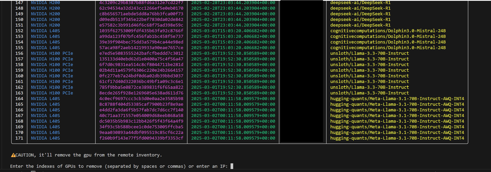

# sn64-tools
Bittensor Subnet 64 (Chutes) tools


## Prerequisites

Before you start, make sure you have the following installed on your system:

- Python 3.12 or higher
- `git`
- `pip`

---

## Installation Steps

### 1. Clone the Repository

First, clone the repository to your local machine:

```bash
git clone https://github.com/minersunion/sn64-tools.git
cd sn64-tools
```

### 2. Create and Activate a Virtual Environment
```bash
python -m venv venv
source venv/bin/activate
```

### 3. Install the Project in Editable Mode
```bash
pip install --upgrade pip
pip install -r requirements.txt
pip install -e .
```


## How to use?

### 1.
Edit the `wallets.py` file with your wallet names.

### 2.

In your terminal, use this command to run the script:
```sh
python src/delete-remote-gpu.py
```

It will display all your miner GPUs known by the Chutes validator in a rich table.
And then it will prompt you for GPU index numbers or IPs to delete from the validator.



## Why?
Many miners don't know how to delete their orphan GPUs from the remote validator DB, so they need to ping the subnet owner multiple times per day so that he can do it himself.

But if miners delete their own left over GPUs they they do not use anymore, it may help.
